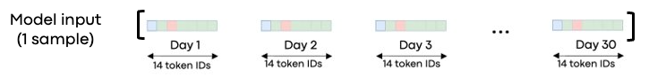
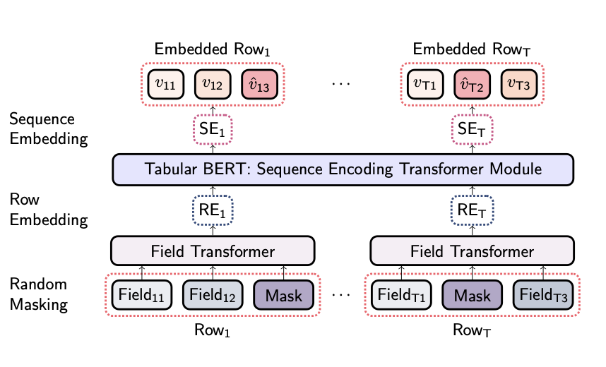

# Documentation for TabFormerLite

## Available functionalities

TabFormerLite can be used to accomplish the following tasks:
1. Pre-processing input data to be compatible with the model.
2. Pre-training the model through masked language modeling (MLM) task.
3. Extracting embeddings from pre-trained models using various pooling strategies accross both the layer and time dimensions. These embeddings can be used as input to simpler machine-learning models to perform downstream tasks.
4. Fine-tuning the model on regression and classification tasks.

## Getting started

Check out our [tutorial](../tutorial/tutorial.ipynb) for a demonstration of how to use TabFormerLite.

## 1. Data pre-processing

The model requires the input data to be, first, *tokenized* and *encoded* as unique numerical identifiers and, then, shaped into fixed-length sequences.
The data pre-processing step prepares tabular data to be compatible with the model by implementing the following:
- Discretizes tabular data into discrete information units, much like ​NLP tokens, and assigns unique numerical identifiers​ to these units.
- A sliding window approach shapes the encoded tabular data into fixed-length sequences.

The outputs of the pre-processing step are exported in a user-specified directory to facilitate loading during the subsequent pre-training and fine-tuning phases.

### 1.1 Data discretization and encoding

The first step involves *breaking down* raw tabular data into atomic units, much like tokens in language modeling tasks, to generate distinct "local" vocabularies for each feature in the data. Local vocabularies are subsequently grouped into a collective "global" vocabulary.

The data pre-processing step offers three options for data discretization:
- LabelEncoder: This is applied to categorical columns. It encodes categorical values into numerical labels.
- Quantile Binning: This is used for continuous columns. It discretizes continuous data into quantiles or bins, which can be thought of as buckets or categories.
- No Transformation: For columns that are already "discrete", such as columns with integer values, no additional transformation is applied.

However, real-world datasets often defy conventional data type expectations. For instance, discrete variables may be labeled with `float64` rather than `int64` data types. Consequently, in such cases, we cannot solely rely on default data types to determine which transformation to apply.

To address this, we have adopted the following approach:
- If the data type is `object`, the column is considered categorical and is transformed using the LabelEncoder.
- If the data type is not `object` (indicating that the column could be either discrete or continuous), then:
    * If the column contains fewer unique values than a specified threshold of unique values, denoted as `n_max`, the column is left unaltered.
    * If the column contains more unique values than the specified threshold `n_max`, it is discretized using quantile binning.

By setting `n_max` to a specific value, users can control which columns are transformed using quantile binning based on the number of unique values in the column. For example, if `n_max` is set to 50, columns with less than 50 unique values will not be transformed, while those with more than 50 unique values will undergo quantile binning.

### 1.2 Data sequencing using sliding windows

The sliding window approach shapes the encoded tabular data into sequences suitable for the model.
The window length, denoted as `seq_len`, defines the number of consecutive data points included in each window, and the stride (indicated as `stride`) determines the step size for moving the window forward.

### Example

In the illustration below, we show a visual representation of an input sample pre-processed for the model.
For this illustration, we utilized a dataset containing daily transactions, with each transaction having 14 attributes, and used `seq_len=30` to form sliding windows.

After pre-processing, the attributes within each daily transaction have been transformed into distinct numerical identifiers, which are depicted as "token IDs" in the image.
Each input sample is represented as a sequence of 30 consecutive time steps (or transaction points in this example), labeled as "Day 1", "Day 2", and so forth, up to "Day 30" as shown in the image.

<p align="center"></p>

### 1.3 Usage example

Running the following command line will pre-process your data to be suitable for the model.

```
$ python3 scripts/encode_dataset.py -cfg --path-to-config-files
```

An example of a configuration file is available in: `./configs/example/data_encoding/` and can be used like this:

```
$ python3 scripts/encode_dataset.py -cfg ./configs/example/data_encoding/config_card_dataset_encoding.json
```
### 1.4 Configuration file

Below, we describe the parameters expected in the configuration file for pre-processing tabular data.

* ```data_dir```: directory path where the csv file with the raw tabular data is available.
* ```data_name```: name of the csv file containing the raw data in the data_dir.
* ```user_col```: name of the user id column.
* ```date_col```: name of the date column.
* ```target_col```: name of the target column.
* ```seq_len```: number of consecutive data points in each window.
* ```stride```: step size for moving the window forward. If `stride` is smaller than `seq_len`, the sliding windows will overlap.
* ```num_bins```: number of bins to use when discretizing continuous columns with quantile binning.
* ```n_max```: a user-specified threshold of unique values in a column determining whether the column should be discretized using quantile binning. Please check the section "1.1 Data Discretization and Encoding" above for details.
* ```encoded_data_dir```: directory path where the folder with the outputs of the pre-processing step will be saved.
* ```encoded_data_folder```: folder where the outputs of the pre-processing step will be saved. This folder will be placed inside the `encoded_data_dir` directory.

## 2. Pre-training

The model can be pre-trained using a "masked language model" (MLM) pre-training objective, drawing inspiration from the method used to pre-train BERT in the paper [BERT: Pre-training of Deep Bidirectional Transformers for Language Understanding](https://arxiv.org/abs/1810.04805). Pre-trained models can be used to extract high-quality features or can be fine-tuned on specific downstream tasks (classification, regression, etc.).

The model is a hierarchical transformer with two transformer encoders working sequentially. The first encoder, the field transformer, processes each time step in the time series sequence individually. The output of the field transformer is then fed to a BERT encoder which processes all time steps in the sequence. In other words, the field transformer tries to capture relationships within a time step, whereas BERT encodes relationships among the time steps in the sequence, capturing temporal components in the time series data.

<p align="center"></p>

*(Source: [Padhi et al 2021](https://arxiv.org/abs/2011.01843))*

### 2.1 Learning rate schedule

To pre-train the model, a learning rate schedule is employed comprising the following:
- A linear warm-up phase, during which the learning rate increases linearly from 0 to a maximum value $lr_{max}$.
- An inverse square root decay phase, where the learning rate decreases from $lr_{max}$ to a final zero value.

Users can specify the duration of the warm-up phase by using the `warmup_steps_in_epochs` parameter in the configuration file. For instance, if `warmup_steps_in_epochs` is set to 1, the warm-up phase will extend for one epoch. Importantly, `warmup_steps_in_epochs` can also accept fractional values, such as 0.5, allowing for finer control over the warm-up duration.

The maximum learning rate, $lr_{max}$, can be specified using the `lr_max` parameter in the configuration file.

### 2.2 MLM metric evaluation

We have implemented custom functions to evaluate the model's performance on the MLM task. These MLM metrics can be visualized using [TensorBoard](https://www.tensorflow.org/tensorboard/get_started) and are evaluated on the validation set. They include:

* Cross-entropy loss
* Accuracy
* Weighted f1-score
* Macro f1-score
* Recall
* Precision

### 2.3 Usage example

Once the data pre-processing step is complete, use the following command to pre-train the model.
```
$ python3 scripts/run_mlm_pretraining.py -cfg --path-to-config-files
```

An example of a configuration file is available in: `./configs/example/pre-training/` and can be used like this:

```
$ python3 scripts/run_mlm_pretraining.py -cfg ./configs/example/pretraining/config_card_dataset_size_300.json
```

### 2.4 Configuration file

Below, we describe the parameters expected in the configuration file for pre-training the model.

* ```seed```: random seed.
* ```encoded_data_dir```: directory path where the folder with the outputs of the pre-processing step is saved.
* ```encoded_data_name```: folder where the outputs of the pre-processing step are saved. This folder should be inside the `encoded_data_dir` directory.
* ```output_dir```: directory path where the outputs of the pre-training step are stored.
* ```output_folder```: folder name inside `output_dir` where the experiment outputs will be stored.
* ```add_date_suffix_to_output```: boolean flag used to add the experiment date as a suffix to the output_folder name.
* ```field_hidden_size```: embedding size used in the field transformer.
* ```tab_embeddings_num_attention_heads```: number of attention heads in the field transformer.
* ```tab_embedding_num_encoder_layers```: number of encoder layers in the field transformer.
* ```tab_embedding_dropout```: dropout rate for the field transformer.
* ```num_attention_heads```: number of attention heads for the BERT encoder
* ```num_hidden_layers```: number of hidden layers for the BERT encoder.
* ```hidden_size```: embedding size for BERT encoder. This will also be the size of the embeddings extracted from a pre-trained model.
* ```mlm_average_loss```: boolean flag used to average the MLM losses of each column instead of summing them.
* ```mlm_probability```: rate of masking tokens in the input data for the MLM pre-training.
* ```batch_size```: batch size.
* ```grad_acc_steps```: number of training steps to accumulate before performing a backward pass.
* ```logging_per_epoch```: how many times to log per epoch. Controls the frequency of eval steps and TensorBoard logs.
* ```num_epochs```: number of epochs to perform during pre-training.
* ```checkpoint_every_N_epochs```: how many epochs to wait before making a checkpoint of the model. It can be a float (e.g., 0.5).
* ```lr_max```: maximum learning rate reached at the end of the preliminary warm-up phase.
* ```warmup_steps_in_epochs```: how many epochs should the learning rate warm-up phase last. It can be a float (e.g., 0.5) and should be less than `num_epochs`.
* ```save_total_limit```: the maximum number of model checkpoints to keep in the output_dir.
* ```resume_from_checkpoint```: boolean flag. If true, training will resume from the checkpoint directory in ```checkpoint_dir```. Otherwise, training will start from scratch.
* ```checkpoint_dir```: If `resume_from_checkpoint` is true, this parameter should contain the path to the checkpoint directory from which to resume training.

## 3. Embedding extraction from pre-trained models

Once the pre-training phase is completed, we can obtain contextually enhanced representations (embeddings) for each time step within a time-series sequence. This procedure usually involves utilizing data that was not part of the model's pre-training dataset.

To obtain these embeddings, we pre-process the "inference" data like how we pre-processed the data used for model pre-training. The next step entails performing a forward pass through the pre-trained model and collecting the hidden states from one or more BERT layers.

For instance, if the BERT encoder has 12 layers and a hidden size of 300, the shape of the model output will be:
```
Output shape: [num_BERT_layers + 1, batch_size, sequence_length, hidden_size]
```
Example:
```
Output shape: [13, batch_size, 30, 300]
```

In this example, the first dimension of the output is 13, with the first part representing the input embeddings and the remaining 12 representing BERT's layers.

For a single input sample, we can observe that there are 13 x 30 = 390 distinct hidden states (embeddings) that can be extracted from the model, where each embedding will have a size of 300.

### 3.1 Pooling Strategies

What can we do with these hidden states? We have two choices:

1. We can aim to derive a single vector representation for each input sample. These vector representations can then be inputs to simpler machine learning models such as Logistic Regression or XGBoost to perform downstream tasks. To obtain distinct embeddings for each input sample, we need to "aggregate" the output hidden states across both the layer and time dimensions.

2. Alternatively, we can obtain a sequence of vector representations for each input sample. This specific output can be employed with recurrent neural networks and 1D convolutional neural networks. To acquire sequences of embeddings for each input sample, we should "aggregate" the output hidden states across the layer dimension only.


#### Layer pooling

Four distinct layer pooling strategies can be applied to combine hidden states from different layers:

* Concatenation Pooling: With this strategy, we concatenate activations from multiple hidden layers.
* Maximum Pooling: This strategy returns the maximum activation from the chosen layers.
* Weighted Layer Pooling: This strategy returns the mean activations from the chosen layers.
* Single-Layer Pooling: This strategy returns the activations from a single layer, as determined by the user.

For the first three strategies, users can specify which BERT layers to "aggregate" using the `select_layers` parameter in the configuration file. The available choices include `last_two` (utilizing the last two hidden layers closest to the output), `last_three` (utilizing the last three hidden layers closest to the output), and `last_four` (utilizing the last four hidden layers, closest to the output).

In the single-layer pooling strategy, users can specify which BERT layer to use with the `pooling_layer` parameter in the configuration file. The `pooling_layer` parameter can take any integer value within the range -1 to -(num_BERT_layers+1). For example, if BERT has 12 layers, the `pooling_layer` parameter can range from -1 (referring to the last layer, closest to the output) to -13.

#### Time pooling

The available strategies for pooling accross the time dimension are: mean pooling, max pooling, and no pooling.

To implement the mean pooling and max pooling strategies, users must also specify a value for the `nbr_days` parameter, corresponding to the number of time steps considered for time pooling. Time pooling starts from the most recent day and extends to -nbr_days days within the sequence. `nbr_days` should be non-zero and less or equal to `seq_len`. The `no_pooling` strategy does not require a value for `nbr_days`.

Here's how each of these time-pooling strategies work:
* Mean pooling: This strategy involves averaging the activations from the selected layer(s) along the time axis for a period of `nbr_days`, commencing with the most recent day.
* Max pooling: In this strategy, the maximum activation along the time axis is returned from the selected layer(s) across the specified period of `nbr_days`.
* No pooling: This strategy returns the activations from the selected layer(s) without any pooling along the time axis.

### 3.2 Usage example

Running the following command line extracts embeddings from a pre-trained model.

```command line
$ python3 scripts/inference_main.py -cfg --path-to-config-files
```
An example of a configuration file is available in the folder: `./configs/example/inference/` and can be used like this:
e.g.
```command line
$ python3 scripts/inference_main.py -cfg configs/example/inference/config_card_dataset_inference.json
```

### 3.3 Configuration file

The configuration file for extracting embeddings from a pre-trained model requires information about five distinct components:
- The pre-trained model
- The data used to pre-train the model
- The inference data, for which we will extract embeddings from the pre-trained model
- The inference configuration
- The downstream task

### 3.3.1 pretrained_model_config

The `pretrained_model_config` is a dictionary providing information about the pre-trained model with the following arguments:

* `model_directory`: directory path where the outputs of the pre-training step were  stored (same as `output_dir` in the pre-training config file)
* `model_name`: folder name inside `model_directory` containing one (or more) model checkpoints (same as `output_folder` in the pre-training config file). Providing an empty folder will throw an `AssertionError`.
* `ckpt_dir`: this optional argument can be used to specify the desired checkpoint to use for loading a pre-trained model from (e.g., `"ckpt_dir : "checkpoint-9696"`). Setting `"ckpt_dir : ""` or if `ckpt_dir` is omitted from the configuration file, the model weights are loaded from the most recent checkpoint available in the model directory.

### 3.3.2 pretraining_data_config

The `pretraining_data_config` is a dictionary providing information about the data used to pre-train the model with the following argument:

* `path_to_config_file`: path to the configuration file with information about the data used to pre-train the model. This configuration file is exported at the end of the pre-processing step and can be loaded from this path: `encoded_data_dir/encoded_data_folder` (see section 1.4 for details).

### 3.3.3 inference_data_config

The `inference_data_config` is a dictionary with information about the inference data, with the following argument:

* `data_directory`: the path to the directory containing the train/validation/test datasets we want to extract embeddings for. These datasets should be provided in separate CSV files. The `set_type` should appear at the beginning of the CSV file name, followed by an underscore: e.g., `train_data_inference.csv`
```
└── data_directory
    ├── train_data_inference.csv
    ├── validation_data_inference.csv
    └── test_data_inference.csv
```
### 3.3.4 inference_config

In the `inference_config` part of the configuration file, the user should specify the strategies for "aggregating" hidden states from pre-trained models across both the layer and time dimensions.

#### Pooling across the time axis

The supported pooling strategies are: `mean_pooling`, `max_pooling` and `no_pooling` across the time axis.

The `nbr_days` parameter is the number of time steps over which time pooling is performed, starting from the most recent day and up to -nbr_days days in the sequence. Note that `nbr_days` should be non-zero and less or equal to `seq_len`. The `no_pooling` strategy does not require a value for `nbr_days`.

- In "mean_pooling", the activations from the selected layer(s) are averaged on the time axis over `nbr_days`, starting from the most recent one.
- In "max_pooling", we return the maximum activation on the time axis from the selected layer(s) across `nbr_days`.
- In "no_pooling", we return the activations from the selected layer(s) without any pooling along the time axis.

| **strategy**  | **nbr_days**  |
|:---:|:---:|
| "mean_pooling"    | $\in$ (0, seq_len] |
| "max_pooling"     | $\in$ (0, seq_len] |
| "no_pooling"  | _param not used_  |

#### Pooling across the layer axis

The supported pooling strategies are: `concat_pooling`, `max_layer_pooling`, `weighed_layer_pooling`, and `single_layer_pooling`.

For the first three strategies, users can specify which BERT layers to "aggregate" by using the `select_layers` parameter in the configuration file. The available choices include `last_two` (utilizing the last two hidden layers closest to the output), `last_three` (utilizing the last three hidden layers closest to the output), and `last_four` (utilizing the last four hidden layers, closest to the output).

In the `single_layer_pooling`, users can specify which BERT layer to use with the `pooling_layer` parameter in the configuration file. The `pooling_layer` parameter can take any integer value within the range -1 to -(num_BERT_layers+1). For example, if BERT has 12 layers, the `pooling_layer` parameter can range from -1 (referring to the last layer, closest to the output) to -13.

| **strategy**  | **pooling_layer**     | **selected_layers**   |
|:---:  |:---:  |:---:  |
| `single_layer_pooling`    | $\in$ [-1, -(num_BERT_layers+1)]  | _param not used_  |
| `concat_pooling`  | _param not used_  | `last_two`, <br> `last_three` or <br> `last_four`     |
| `max_layer_pooling`   | _param not used_  | `last_two`,  <br> `last_three` or  <br> `last_four`   |
| `weighed_layer_pooling`| _param not used_     | `last_two`,  <br> `last_three` or  <br> `last_four`   |

Below are the parameters that the user should specify in the `inference_config` part of the configuration file, with the following arguments:

* `batch_size`: the batch_size used to extract embeddings from the pre-trained model
* `pooling_on_time_axis`: a dictionary with information on pooling along the time axis.
    * `strategy`: strategy for pooling embeddings on the time axis. The supported pooling strategies are: `mean_pooling`, `max_pooling`, and `no_pooling`.
    * `nbr_days`: the number of time dimensions over which pooling is performed, starting from the most recent day to -nbr_days days in the sequence.
* `pooling_on_layer_axis`: a dictionary with information on how to perform pooling along BERT layers.
    * `strategy`: strategy for pooling embeddings on the layer axis. The supported pooling strategies are: `concat_pooling`, `max_layer_pooling`, `weighed_layer_pooling`, and `single_layer_pooling`.
    * `pooling_layer`: the BERT layer to pool from in the `single_layer_pooling` strategy. Possible values are between -1 and -(num_BERT_layers+1).
    * `selected_layers`: the BERT layers to pool from in the: `concat_pooling`, `max_layer_pooling`, `weighed_layer_pooling` strategies. Available options: `last_two`, `last_three`, and `last_four`.

### 3.3.4 downstream_task_config

The ```downstream_task_config``` is a dictionary with information about the downstream task, with the following arguments:

* `target_cols_to_include`: list of the label names to merge with the extracted embeddings
* `path_to_data_with_labels`: the path to file(s) containing the user, date, and label columns that we want to merge with the extracted embeddings. `path_to_data_with_labels` can be the path to a file containing the labels for the train/validation/test data or a path to a directory containing multiple files with the required labels. The supported file formats are csv and parquet.
* `output_dir`: the path to the output directory where the embeddings and labels will be saved
* `user_col`: name of the user id column in the file containing the labels.
* `date_col`: name of the date column in the file containing the labels.

## 4. Fine-tuning

In the fine-tuning strategy, we substitute the Masked Language Model (MLM) task head, initially utilized for model pre-training, with a classification or regression layer. Subsequently, we fine-tune all parameters simultaneously on a downstream task.

Currently, we support only the following downstream task:
- Binary classification

To fine-tune the model, a learning rate schedule. This schedule is similar to the one used during pre-training and includes a linear warm-up phase, and an inverse square root decay phase (refer section 2.1 for details).

Additionally, we incorporate early stopping into the training process to stop training based on a user-specified metric, when the model is about to overfit.

### 4.1 Metric evaluation

We have implemented custom functions to evaluate the model's performance during fine-tuning. These metrics can be visualized using [TensorBoard](https://www.tensorflow.org/tensorboard/get_started) and are evaluated on the validation set. They include:

#### 4.1.1 Classification metrics

* Accuracy
* F1-score
* Macro f1-score
* Recall
* Precision

### 4.2 Example usage

Running the following command line will fine-tune the model on a downstream task.

```command line
$ python3 scripts/finetuning.py -cfg --path-to-config-files
```

An example of a configuration file is available in the folder: `./configs/example/finetuning/` and can be used like this:
e.g.
```command line
$ python3 scripts/finetuning.py -cfg configs/example/finetuning/config_card_finetuning.json
```

### 4.3 Configuration file

The configuration file for fine-tuning the model requires information about four distinct components:
- The pre-trained model
- The data used to pre-train the model
- The "inference" data to use for fine-tuning the model
- The fine-tuning configuration

### 4.3.1 pretrained_model_config

The `pretrained_model_config` is a dictionary providing information about the pre-trained model with the following arguments:

* `model_directory`: directory path where the outputs of the pre-training step were  stored (same as `output_dir` in the pre-training config file)
* `model_name`: folder name inside `model_directory` containing one (or more) model checkpoints (same as `output_folder` in the pre-training config file). Providing an empty folder will throw an `AssertionError`.
* `ckpt_dir`: this optional argument can be used to specify the desired checkpoint to use for loading a pre-trained model from (e.g., `"ckpt_dir : "checkpoint-9696"`). Setting `"ckpt_dir : ""` or if `ckpt_dir` is omitted from the configuration file, the model weights are loaded from the most recent checkpoint available in the model directory.

### 4.3.2 pretraining_data_config

The `pretraining_data_config` is a dictionary providing information about the data used to pre-train the model with the following argument:

* `path_to_config_file`: path to the configuration file with information about the data used to pre-train the model. This configuration file is exported at the end of the pre-processing step and can be loaded from this path: `encoded_data_dir/encoded_data_folder` (see section 1.4 for details).

### 4.3.3 finetuning_data_config

The `finetuning_data_config` is a dictionary with information about the data to use for fine-tuning the model, with the following argument:

* `data_directory`: the path to the directory containing the train/validation/test datasets we want to extract embeddings for. These datasets should be provided in separate CSV files. The `set_type` should appear at the beginning of the CSV file name, followed by an underscore: e.g., `train_data_inference.csv`
```
└── data_directory
    ├── train_data_inference.csv
    ├── validation_data_inference.csv
    └── test_data_inference.csv
```

### 4.3.4 training_config

The `training_config` is a dictionary with information about the fine-tuning configuration, with the following arguments:

* `seed`: seed for the randomness.
* `output_dir` : path to the directory where the experiment outputs will be stored.
* `output_folder` : name of the subdirectory in output_dir where the experiment outputs will be stored.
* `add_date_suffix_to_output`: boolean flag used to add the experiment date as a suffix to the output_folder name.
* `batch_size`: batch_size
* `grad_acc_steps`: number of training steps to accumulate before performing a backward pass.
* `logs_per_epoch`: how many times to log per epoch. Controls the frequency of eval steps and TensorBoard logs.
* `num_epochs`: The total number of epochs intended for fine-tuning. If the early stopping criterion is satisfied, training will stop before reaching the specified `num_epochs`.
* `checkpoint_every_N_epochs`: how many epochs to wait before making a checkpoint of the model. Can be a float (e.g. 0.5).
* `lr_max`: maximum learning rate reached at the end of the preliminary warm-up phase.
* `warmup_steps_in_epochs`: how many epochs should the learning rate warm-up last. It can be a float (e.g., 0.5), but should be less than `num_epochs`.
* `save_tot_lim`: the maximum number of model checkpoints to keep in the output_dir.
* `problem_type`: Down-stream task type. Supported option: `classification` (implements binary classification).
* `compute_pos_weight`: optional boolean flag, used if `problem_type` is `classification`. If true, the user should specify the `pos_weight` parameter (see below).
* `pos_weight`: optional parameter, required if `compute_pos_weight` is true. It is the weight used with the minority class loss in `BCEWithLogitsLoss` and may help improve performance when working with highly imbalanced datasets. One could set `pos_weight` equal to the ratio of negative to positive samples in the training data. If `compute_pos_weight` is false, `pos_weight` is ignored.
* `load_weights_from_pretraining`: optional boolean flag. If true, the model weights are loaded from the pre-trained model. If false, the model weights are initialized randomly.
* `pos_label`: index of the minority class (0 or 1) used to compute classification metrics for the minority class. This parameter is required if `problem_type` is `classification`.
* `early_stopping_patience`: An integer specifying the number of consecutive steps with no improvement on the monitored metric before triggering early stopping. If the model's performance does not improve for the specified patience period, training will be halted to prevent overfitting. If not specified by the user, a default value of 3 will be used.
* `early_stopping_tolerance`: the minimum change required in the specified metric to be considered as an improvement. If not specified by the user, a default value of 0.05 will be used.
* `metric_for_best_model`: optional parameter that can be used to specify the metric to use to compare two different models. Must be the name of a metric returned by the evaluation with or without the prefix "eval_". Defaults to evaluation loss.
